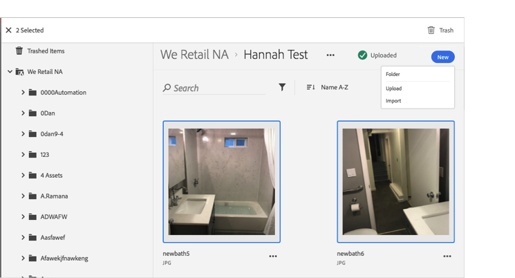

# アセットをごみ箱に入れる{#trash-an-asset}

Adobe Experience Cloud ライブラリ内のアセットをごみ箱に入れて、ライブラリから削除できます。

Experience Cloud ライブラリ内のアセットをごみ箱に入れるには、次の手順を実行します。

1. ごみ箱に入れる 1 つ以上のアセットをクリックします。 

1. ページ上部にある&#x200B;**[!UICONTROL ごみ箱]**&#x200B;アイコンをクリックします。

