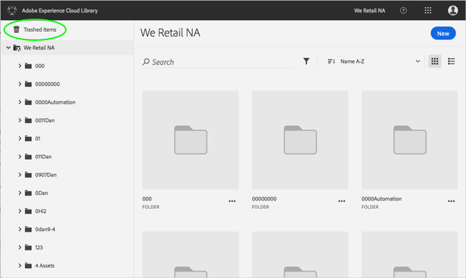

# Trashed Assetの完全な削除{#permanently-delete-a-trashed-asset}

Adobe Experience Cloudライブラリで、アセットを完全に削除できます。

項目をごみ箱表示すると、その項目はExperience Cloudライブラリの"Trashed Items"領域に60日間表示されます。項目を復元しない場合、Experience Cloudライブラリは60日後に完全に削除されます。

60日を超えるトレンドアセットを永久的に削除できます。

1. **[!UICONTROL "Trashed Items]**」をクリックします。

   

1. 削除する項目を1つ以上クリックします。
1. 詳細情報/完全に削除を **[!UICONTROL クリック]**&#x200B;します。

   

1. 選択したアセットを完全に削除することを確認します。

