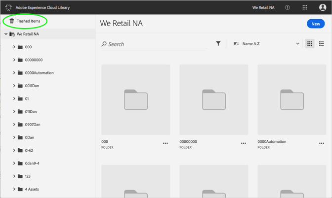

# Trashed Assetの復元{#restore-a-trashed-asset}

Adobe Experience Cloudライブラリで作成したアセットを復元できます。

項目をごみ箱表示すると、その項目はExperience Cloudライブラリの"Trashed Items"領域に60日間表示されます。項目を復元しない場合、Experience Cloudライブラリは60日後に完全に削除されます。

60日を超えるトレンドアセットの復元:

1. **[!UICONTROL "Trashed Items]**」をクリックします。

   

1. 復元する1つまたは複数の項目をクリックします。
1. 詳細情報/復元を **[!UICONTROL クリック]**&#x200B;します。

   

1. 選択したアセットを復元することを確認します。

復元されたアセットの確認が上部に表示されます。
