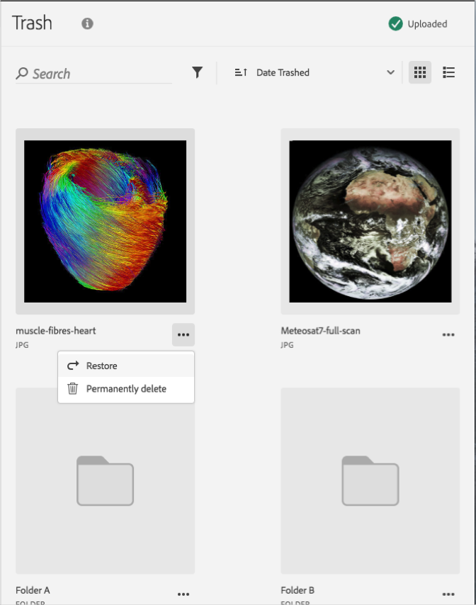

# ごみ箱に入れたアセットの復元{#restore-a-trashed-asset}

Adobe Experience Cloud ライブラリでごみ箱に入れたアセットを復元できます。

項目をごみ箱に入れると、その項目は Experience Cloud ライブラリの「Trashed Items」領域に 60 日間保持されます。項目を復元しない場合、60 日が経過すると、Experience Cloud ライブラリによってその項目は完全に削除されます。

ごみ箱に入れたアセットを 60 日が経過する前に復元するには、次の手順を実行します。

1. 「**[!UICONTROL Trashed Items]**」をクリックします。

   

1. 復元する 1 つ以上の項目をクリックします。
1. **[!UICONTROL More Info／Restore]** をクリックします。

   

1. 選択したアセットを復元することを確認します。

復元されたアセットの確認が上部に表示されます。
