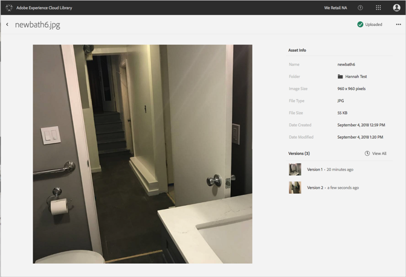

# 以前のバージョンのアセットを表示する{#view-previous-versions-of-an-asset}

Adobe Experience Cloud ライブラリ内のバージョンの、以前のバージョンを表示できます。

Experience Cloud ライブラリ内のバージョンの、以前のバージョンを表示するには、次の手順を実行します。

1. アセットを選択します。
1. アセットの横にある「**[!UICONTROL More Options]**」メニュー（省略記号）を選択します。

   

1. 「**[!UICONTROL Asset Details]**」を選択します。
1. 「Versions」の横にある「**[!UICONTROL View All]**」を選択してすべてのバージョンのアセットを表示します。

   

