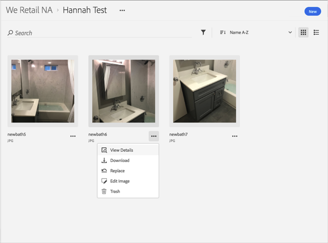

# アセットの前のバージョンの表示{#view-previous-versions-of-an-asset}

Adobe Experience Cloudライブラリで、以前のバージョンのアセットを表示できます。

Experience Cloudライブラリで以前のバージョンのアセットを表示するには:

1. アセットを選択します。
1. アセットの横に **[!UICONTROL あるその他のオプション]** メニュー（省略記号）を選択します。

   

1. **[!UICONTROL 「アセットの詳細]**」を選択します。
1. アセットのすべてのバージョンを表示するには、「バージョン」の横にある「 **[!UICONTROL すべて]** 表示」を選択します。

   

