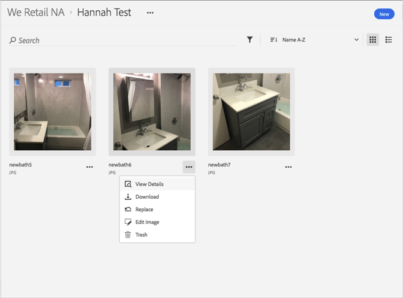

# アセットの置換{#replace-an-asset}

Adobe Experience Cloud ライブラリ内のアセットを置き換えることができます。

Experience Cloud ライブラリ内のアセットを置き換えるには、次の手順を実行します。

1. アセットをクリックします。
1. アセットの横にある&#x200B;**[!UICONTROL その他のオプション]**&#x200B;メニュー（省略記号）をクリックします。

   

1. 「**[!UICONTROL Replace]**」をクリックします。
1. 新しいアセットを選択して、古いアセットを置き換えます。

