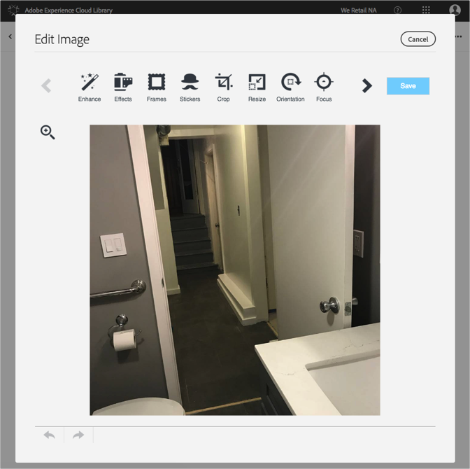

# 画像の編集{#edit-an-image}

Adobe Experience Cloud ライブラリに組み込まれている基本的な画像エディターを使用して、ライブラリから直接画像を編集します。

Experience Cloud ライブラリから画像を編集するには、次の手順を実行します。

1. 編集する画像をクリックします。
1. 「Edit Image」をクリックします。画像を保存すると、新しいバージョンとして保存されます。

   画像エディターが開き、画像を編集できます。

   

