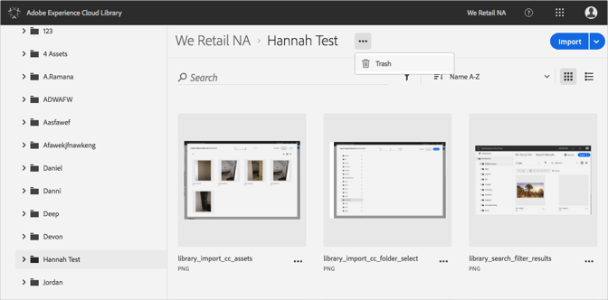
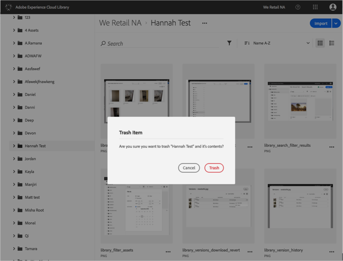

# フォルダのごみ箱フォルダ{#trash-a-folder}

Adobe Experience Cloudライブラリでフォルダをごみ箱に入れることができます。

Experience Cloudライブラリでフォルダをごみ箱に入れるには:

1. ごみ箱のフォルダをクリックします。
1. **[!UICONTROL その他のオプションメニュー]** （省略記号）をクリックし、ごみ箱を選択 ****&#x200B;します。

   

1. フォルダをごみ箱に入れておくことを確認します。

   

