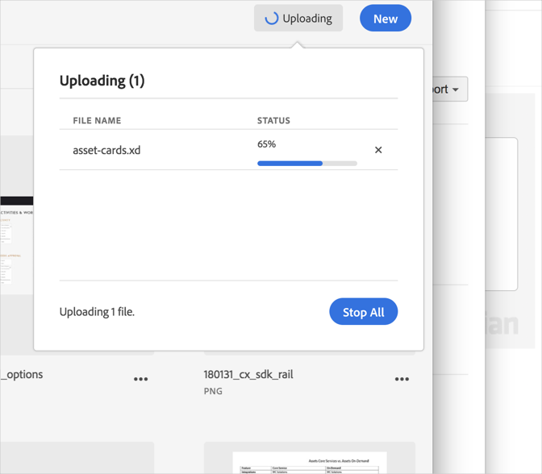

# アップロードのキャンセル{#cancel-an-upload}

ファイルの不正確または大きすぎるファイルを選択した場合、デバイスからAdobe Experience Cloudライブラリへのアップロードをキャンセルします。

既に開始しているアップロードをキャンセルするには:

1. 通知インジケーターをクリックします。
1. すべてのダウンロードを停止するには「 **[!UICONTROL すべて]** 停止」をクリックし、キャンセルするには個別のファイルの横に **[!UICONTROL ある"X"]** をクリックします。

   

同じ名前のファイルを1つまたは複数選択した場合、Experience Cloudライブラリで古いバージョンを置き換えるか、新しいバージョンを保持するかを尋ねるプロンプトが表示されます。
