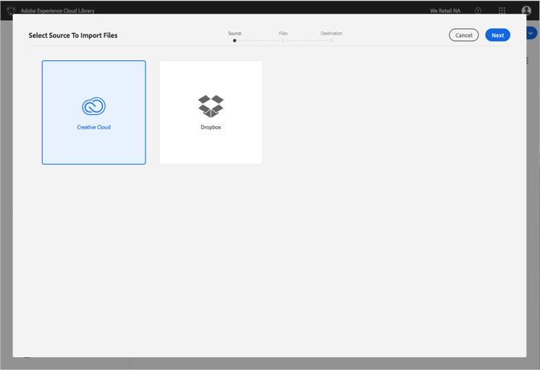
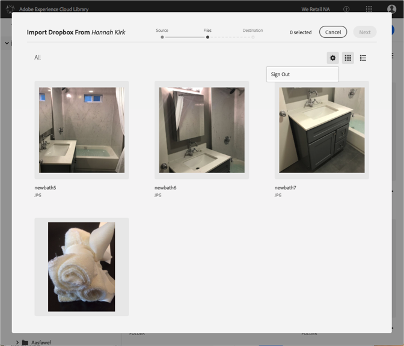

# Dropbox または Creative Cloud アカウントの変更{#change-dropbox-or-creative-cloud-accounts}

Adobe Experience Cloud ライブラリにコンテンツを追加できるよう、別の Dropbox または Creative Cloud アカウントに切り替えます。

Dropbox または Creative Cloud アカウントにログインすると、ログアウトするかアカウントを切り替えるまでログインしたままになります。

別の Dropbox アカウントまたは Creative Cloud アカウントに切り替えるには、次の手順を実行します。

1. **[!UICONTROL 新規]**/**[!UICONTROL 読み込み]**&#x200B;を選択します。

   

1. 「**[!UICONTROL Creative Cloud]**」または「**[!UICONTROL Dropbox]**」を選択します。

   

1. 「**[!UICONTROL Next]**」を選択します。
1. 右上隅の歯車アイコンを選択します。

   

1. 「**[!UICONTROL Sign out]**」を選択します。
1. 別のアカウントにログインします。

