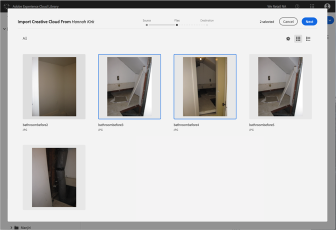
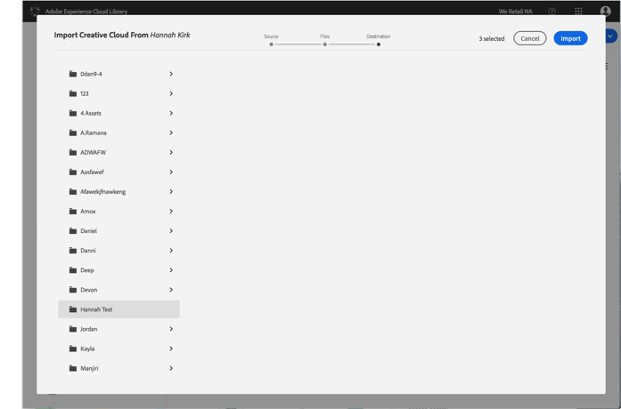

# Adobe Experience CloudライブラリへのCreative Cloudファイルの読み込み{#import-creative-cloud-files-into-the-adobe-experience-cloud-library}

Creative CloudからAdobe Experience Cloudライブラリにファイルをインポートして、任意のAdobe Experience Cloud製品から管理します。

>[!NOTE]
>
>このタスクを実行するには、フォルダーを作成する必要があります。

Creative CloudファイルをExperience Cloudライブラリに読み込むには:

1. **[!UICONTROL 新規]** / **[!UICONTROL 読み込みを選択]**&#x200B;します。

   

1. 「 **[!UICONTROL Creative Cloud]**」を選択します。

   まだCreative Cloudアカウントにサインインしていない場合は、サインインします。

   

1. Click **[!UICONTROL Next]**.
1. 読み込むファイルを1つまたは複数選択します。

   

1. Click **[!UICONTROL Next]**.
1. アセットを配置するフォルダを選択します。

   >[!NOTE]
   >
   >アセットを読み込むフォルダを1つ選択できます。異なるフォルダーにファイルを配置するには、フォルダーごとにこのタスクを繰り返します。

   

1. Click **[!UICONTROL Import]**.

