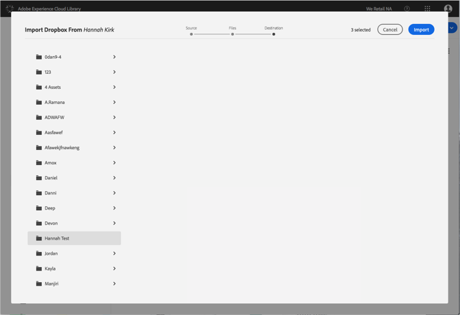

# Dropbox ファイルから Adobe Experience Cloud ライブラリへの読み込み{#import-dropbox-files-into-the-adobe-experience-cloud-library}

Dropbox から Adobe Experience Cloud ライブラリにファイルを読み込んで、任意の Adobe Experience Cloud 製品から管理します。

>[!NOTE]
>
>このタスクを実行するには、フォルダーを作成する必要があります。

Dropbox ファイルを Experience Cloud ライブラリに読み込むには、次の手順を実行します。

1. **[!UICONTROL 新規]**/**[!UICONTROL 読み込み]**&#x200B;を選択します。

   

1. 「**[!UICONTROL Dropbox]**」を選択します。

   まだ Dropbox アカウントにログインしていない場合は、ログインします。

   

1. 「**[!UICONTROL Next]**」をクリックします。
1. 読み込むファイルを 1 つ以上選択します。

   

1. 「**[!UICONTROL Next]**」をクリックします。
1. アセットを配置するフォルダーを選択します。

   >[!NOTE]
   >
   >アセットを読み込むフォルダーは 1 つ選択できます。異なるフォルダーにファイルを配置するには、フォルダーごとにこのタスクを繰り返します。

   

1. 「**[!UICONTROL Import]**」をクリックします。

