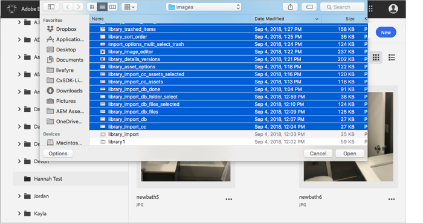
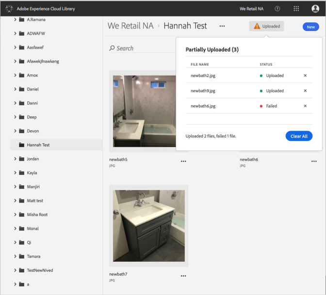

# デバイスからのアセットのアップロード{#upload-asset-from-device}

デバイスからアセットをアップロードして、Adobe Experience Cloud ライブラリで管理します。

デバイスから Experience Cloud ライブラリにアセットをアップロードするには、次の手順を実行します。

1. **[!UICONTROL 新規]**/**[!UICONTROL アップロード]**&#x200B;を選択します。

   

1. Experience Cloud ライブラリにアップロードするアセットを選択します。

   

1. ファイルのアップロードが完了すると、通知ボックスに確認メッセージやエラーメッセージが表示されます。

   

